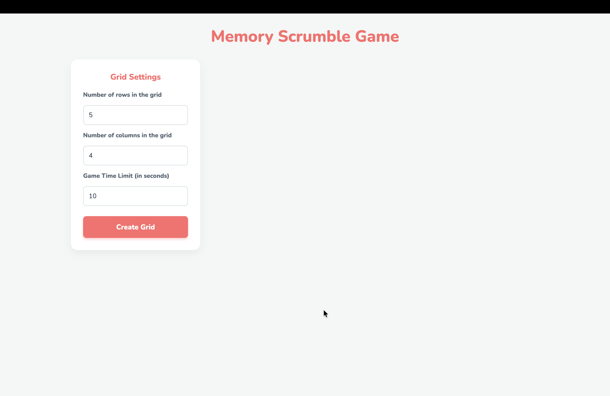
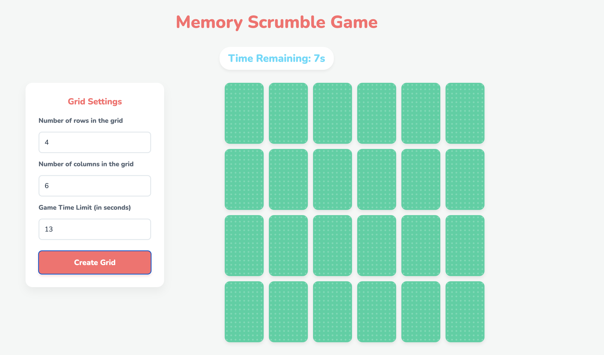
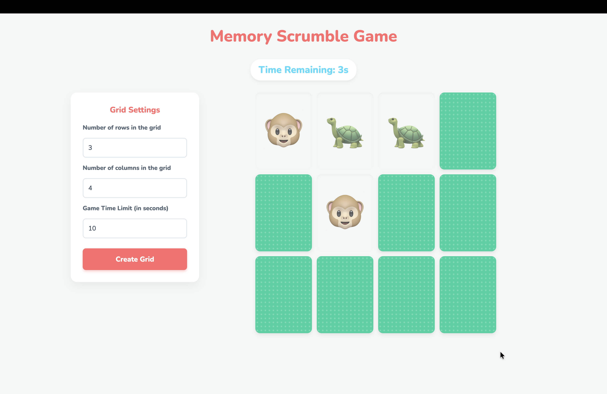
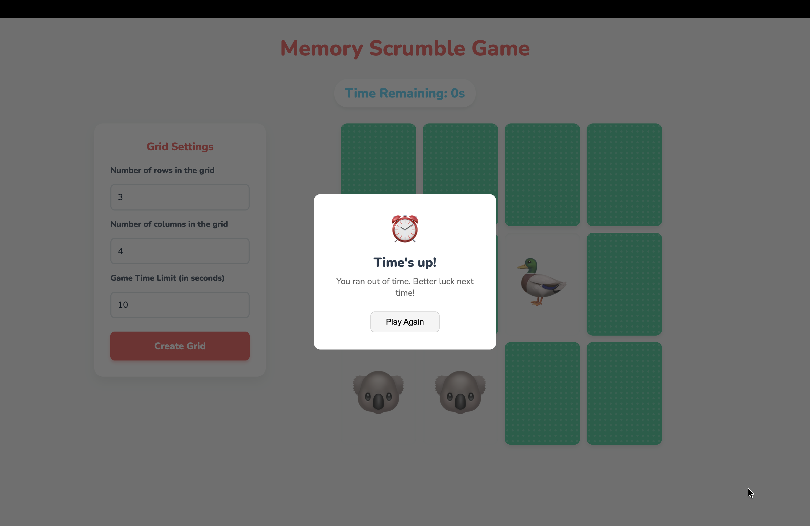
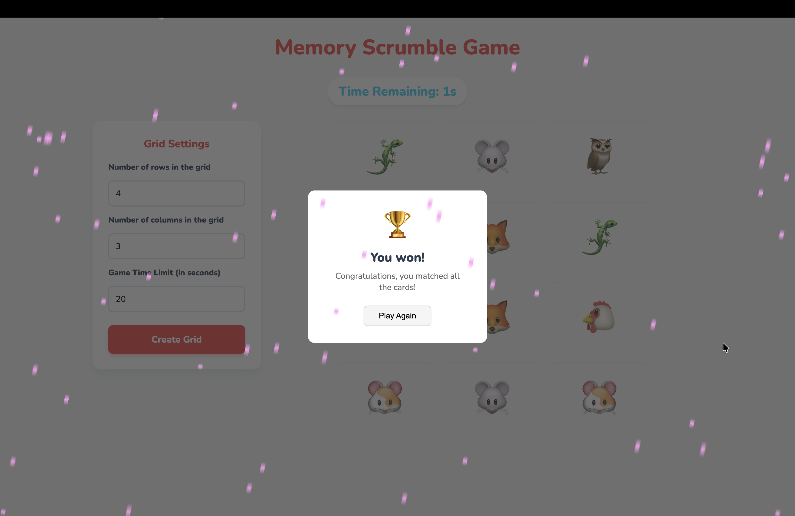

# Memory-Scramble-Game

Memory Scrumble is a fun, customizable, browser-based memory matching game. Test your memory by finding all the matching animal emoji pairs before the time runs out!

## Features

- **Customizable Grid:** Choose the number of rows and columns (from 2x2 up to 10x10) to adjust the difficulty.
- **Time Limit:** Set a custom countdown timer in seconds to race against the clock.
- **Interactive UI:** Features a clean, modern, and colorful flat design with smooth card-flipping hover animations.
- **Audio & Visual Effects:** Enjoy sound effects and a celebratory visual rain/confetti effect upon winning.

## Screenshots

 
 
 
 
 

## How to Run

This is a purely front-end project built entirely with HTML, CSS, and Vanilla JavaScript. There are no complex dependencies or build steps required.

1. Clone this repository to your local machine:
   ```bash
   git clone https://github.com/mrprince74/Scrumble-Game-Test-your-memory
   ```
2. Navigate into the project folder:
   ```bash
   cd Memory-Scramble-Game
   ```
3. Double-click the `index.html` file to open it directly in your default web browser (or right-click and select "Open With" your preferred browser).
4. Set your desired grid size and time limit in the sidebar.
5. Click **Create Grid** to start the timer and begin playing!
